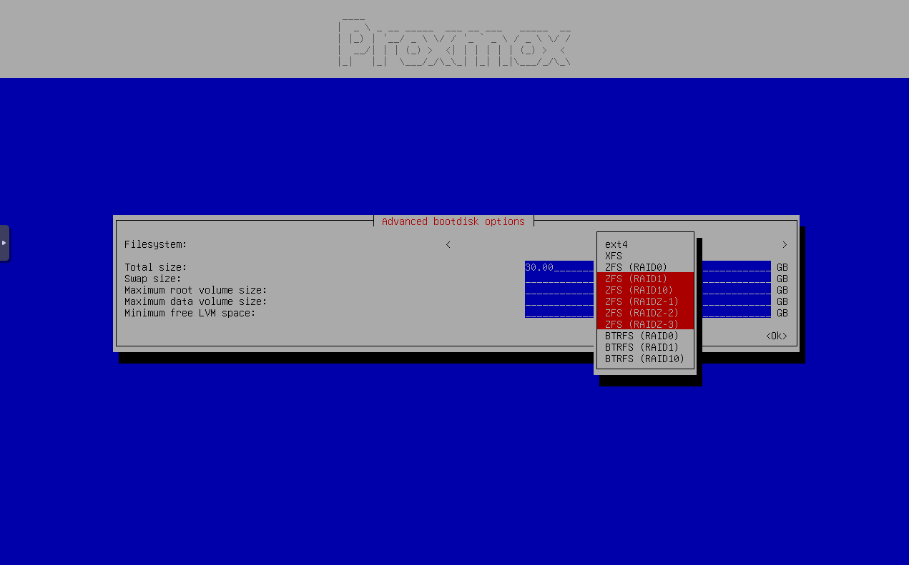
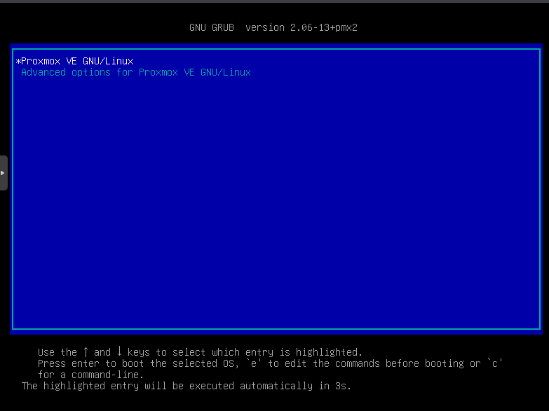
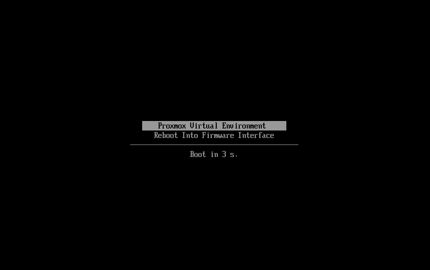

# HOW TO - Encrypt complete Proxmox VE node with LUKS

I was searching myself a way on how to get a full encrypted node, but found no step by step how to, so here it is.

**⚠️ NOTE:** I'm not responsible, if you break something. Make always sure to have a backup before you begin.

This how to works for an existing or fresh Proxmox VE installation, but currently needs a `ZFS (RAID1)`, `ZFS (RAID10)`, `ZFS (RAIDZ-1)`, `ZFS (RAIDZ-2)`, `ZFS (RAIDZ-3)` filesystem. The how to for other filesystems and disk configurations will follow. You are welcome to help to add those steps :-)

Upvote the feature request [here](https://bugzilla.proxmox.com/show_bug.cgi?id=6160) to get LUKS configuration integrated in the Proxmox VE installer. For reference here is also the [Proxmox Forum](https://forum.proxmox.com/threads/feature-request-add-luks-to-installer.162036/) entry, but the upvotes are needed in the Proxmox Bugzilla instance.

If you already have LUKS configured, you can use this guide to make the system bootable again or add unlock options.

What this how to covers:

1. [Fresh installation](#fresh-installation)

   - [ZFS (RAID1), ZFS (RAID10), ZFS (RAIDZ-1), ZFS (RAIDZ-2), ZFS (RAIDZ-3)](#zfs-raid1-zfs-raid10-zfs-raidz-1-zfs-raidz-2-zfs-raidz-3)
2. [Things to check before starting](#things-to-check-before-starting)

   - [Boot loader](#boot-loader)
       - [GRUB](#grub)
       - [systemd-boot](#systemd-boot)
   - [Filesystem](#filesystem)
       - [ZFS (RAID1), ZFS (RAID10), ZFS (RAIDZ-1), ZFS (RAIDZ-2), ZFS (RAIDZ-3)](#zfs-raid1-zfs-raid10-zfs-raidz-1-zfs-raidz-2-zfs-raidz-3-1)
3. [Backup data](#backup-data)
4. [Install requirements](#install-requirements)
5. [Enable LUKS for root partition](#enable-luks-for-root-partition)

   - [ZFS (RAID1), ZFS (RAID10), ZFS (RAIDZ-1), ZFS (RAIDZ-2), ZFS (RAIDZ-3)](#zfs-raid1-zfs-raid10-zfs-raidz-1-zfs-raidz-2-zfs-raidz-3-2)
       - Take offline one ZFS vdev (vitual device)
       - Delete all data on the offline partition and create a LUKS (crypted) partition
       - Mount the crypted volume
       - Replace the old vdev (vitual device) in the ZFS pool with the new empty crypted vdev (vitual device) and wait for resilvering to complete
       - Repeat the same step for the other vdev (vitual device)
6. [Fix the boot procedure](#fix-the-boot-procedure)

    Reconfigure the boot loader to be able to boot and asking for the LUKS password

   - [OPTIONAL: Add possibility to unlock via SSH (dropbear-initramfs)](#optional-add-possibility-to-unlock-via-ssh-dropbear-initramfs)
   - [OPTIONAL: Add automated unlock via TPM](#optional-add-automated-unlock-via-tpm)
   - [OPTIONAL: Add automated unlock via USB key (not yet completed)](#optional-optional-add-automated-unlock-via-usb-key)
   - [OPTIONAL: Add automated unlock via remote server (MandOS)](#optional-add-automated-unlock-via-usb-key)
7. [Enable LUKS for other disks](#enable-luks-for-other-disks)
8. [Troubleshooting](#troubleshooting)
9. [Discussions](#discussions)

## Support maintaining this guide

Writing and maintaining this guide took and continues to take a lot of time and effort to test and update.

If you find it helpful and would like to support my work, any donation would be greatly appreciated. Even a small contribution would mean a lot to me :-)

[](https://www.paypal.com/donate/?hosted_button_id=3NEVZBDM5KABW)

# Fresh installation

## ZFS (RAID1), ZFS (RAID10), ZFS (RAIDZ-1), ZFS (RAIDZ-2), ZFS (RAIDZ-3)

Start the Proxmox VE installer. In the `Target harddisk` step choose `Advanced options` and select `ZFS (RAID1)`, `ZFS (RAID10)`, `ZFS (RAIDZ-1)`, `ZFS (RAIDZ-2)` or `ZFS (RAIDZ-3)`. Then proceed with the installation.




# Things to check before starting

## Boot loader

Check weather your system is using `GRUB` or `systemd-boot` as boot loader. It may be required to know it for some steps.

### GRUB

Is normally used, when you have legacy BIOS enabled or UEFI with secure boot enabled. To check execute

```bash
proxmox-boot-tool status
```

and check, if the output contains `is configured with: grub`

```
root@pve01:~# proxmox-boot-tool status
Re-executing '/usr/sbin/proxmox-boot-tool' in new private mount namespace..
System currently booted with legacy bios
865E-6ADE is configured with: grub (versions: 6.8.12-4-pve, 6.8.12-8-pve)
... or more entries
```

You can also reboot your node and you will see something like this on boot:



### systemd-boot

Is normally used, when you have UEFI with secure boot disabled. To check execute

```bash
proxmox-boot-tool status
```

and check, if the output contains `is configured with: uefi`

```
root@pve01:~# proxmox-boot-tool status
Re-executing '/usr/sbin/proxmox-boot-tool' in new private mount namespace..
System currently booted with uefi
E014-501F is configured with: uefi (versions: 6.8.12-4-pve)
... or more entries
```

You can also reboot your node and you will see something like this on boot:



## Filesystem

Check which filesystem and disk configuration you have.

Currently only the how to for `ZFS (RAID1)`, `ZFS (RAID10)`, `ZFS (RAIDZ-1)`, `ZFS (RAIDZ-2)`, `ZFS (RAIDZ-3)` is completed.

Meanwhile the single disk instructions are work in progress, you can check this tutorial:

- https://forum.proxmox.com/threads/adding-full-disk-encryption-to-proxmox.137051/
- https://gist.github.com/yvesh/ae77a68414484c8c79da03c4a4f6fd55
- https://linsomniac.gitlab.io/post/2020-04-09-ubuntu-2004-encrypted-zfs/
- https://forum.level1techs.com/t/encrypted-proxmox-homeserver-questions-on-how-to-do-it/138997
- https://forum.proxmox.com/threads/create-custom-pve-iso-from-original-pve-iso.123606/#post-538612
- https://forum.proxmox.com/threads/native-full-disk-encryption-with-zfs.140170/
- https://privsec.dev/posts/linux/using-native-zfs-encryption-with-proxmox/
- https://xiu.io/posts/18-proxmox-zfs-fde/

### Single disk (🚨 HOW TO NOT YET COMPLETED, DO NOT TRY)

Your current disk setup should look similar to something like this:

#### ZFS

```bash
root@pve01:~# lsblk | grep -v zd
NAME      MAJ:MIN RM  SIZE RO TYPE MOUNTPOINTS
sda         8:0    0  1.8T  0 disk
├─sda1      8:1    0 1007K  0 part
├─sda2      8:2    0    1G  0 part
└─sda3      8:3    0  1.8T  0 part
```

or

```bash
root@pve01:~# lsblk | grep -v zd
NAME        MAJ:MIN RM  SIZE RO TYPE MOUNTPOINTS
nvme0n1     259:0    0  1.8T  0 disk
├─nvme0n1p1 259:1    0 1007K  0 part
├─nvme0n1p2 259:2    0    1G  0 part
└─nvme0n1p3 259:3    0  1.8T  0 part
```

#### EXT4

```bash
root@pve01:~# lsblk | grep -v zd
NAME               MAJ:MIN RM  SIZE RO TYPE MOUNTPOINTS
sda                  8:0    0  1.8T  0 disk
├─sda1               8:1    0 1007K  0 part
├─sda2               8:2    0    1G  0 part
└─sda3               8:3    0  1.8T  0 part
  ├─pve-swap       252:0    0  1.9G  0 lvm  [SWAP]
  ├─pve-root       252:1    0  1.8T  0 lvm  /
  ├─pve-data_tmeta 252:2    0    1G  0 lvm
  │ └─pve-data     252:4    0  1.8T  0 lvm
  └─pve-data_tdata 252:3    0  1.8T  0 lvm
    └─pve-data     252:4    0  1.8T  0 lvm
```

or

```bash
root@pve01:~# lsblk | grep -v zd
NAME               MAJ:MIN RM  SIZE RO TYPE MOUNTPOINTS
nvme0n1            259:0    0  1.8T  0 disk
├─nvme0n1p1        259:1    0 1007K  0 part
├─nvme0n1p2        259:2    0    1G  0 part
└─nvme0n1p3        259:3    0  1.8T  0 part
  ├─pve-swap       252:0    0  1.9G  0 lvm  [SWAP]
  ├─pve-root       252:1    0  1.8T  0 lvm  /
  ├─pve-data_tmeta 252:2    0    1G  0 lvm
  │ └─pve-data     252:4    0  1.8T  0 lvm
  └─pve-data_tdata 252:3    0  1.8T  0 lvm
    └─pve-data     252:4    0  1.8T  0 lvm
```

#### BTRFS

```bash
root@pve01:~# lsblk | grep -v zd
NAME   MAJ:MIN RM  SIZE RO TYPE MOUNTPOINTS
sda      8:0    0  1.8T  0 disk
├─sda1   8:1    0 1007K  0 part
├─sda2   8:2    0    1G  0 part
└─sda3   8:3    0  1.8T  0 part /
```

or

```bash
root@pve01:~# lsblk | grep -v zd
NAME        MAJ:MIN RM  SIZE RO TYPE MOUNTPOINTS
nvme0n1     259:0    0  1.8T  0 disk
├─nvme0n1p1 259:1    0 1007K  0 part
├─nvme0n1p2 259:2    0    1G  0 part
└─nvme0n1p3 259:3    0  1.8T  0 part /
```

### ZFS (RAID1), ZFS (RAID10), ZFS (RAIDZ-1), ZFS (RAIDZ-2), ZFS (RAIDZ-3)

#### Disk layout

Your current disk setup should look similar to something like this:

```bash
root@pve01:~# lsblk | grep -v zd
NAME      MAJ:MIN RM   SIZE RO TYPE MOUNTPOINTS
sda         8:0    0   1.8T  0 disk
├─sda1      8:1    0  1007K  0 part
├─sda2      8:2    0     1G  0 part
└─sda3      8:3    0   1.8T  0 part
sdb         8:16   0   1.8T  0 disk
├─sdb1      8:17   0  1007K  0 part
├─sdb2      8:18   0     1G  0 part
└─sdb3      8:19   0   1.8T  0 part
... or more disks
```

or

```bash
root@pve01:~# lsblk | grep -v zd
NAME        MAJ:MIN RM   SIZE RO TYPE MOUNTPOINTS
nvme0n1     259:0    0   1.8T  0 disk
├─nvme0n1p1 259:1    0  1007K  0 part
├─nvme0n1p2 259:2    0     1G  0 part
└─nvme0n1p3 259:3    0   1.8T  0 part
nvme1n1     259:4    0   1.8T  0 disk
├─nvme1n1p1 259:5    0  1007K  0 part
├─nvme1n1p2 259:6    0     1G  0 part
└─nvme1n1p3 259:7    0   1.8T  0 part
... or more disks
```

#### ZFS pool

Your current zpool setup should look similar to something like you find [here](#zfs-raid1-zfs-raid10-zfs-raidz-1-zfs-raidz-2-zfs-raidz-3-2).

# Backup data

🚨 Before proceeding, ensure you have a backup of your configuration and data if it's not a freshly installed system. These steps can result in data loss if not done correctly.

Backup Proxmox VE configuration: https://forum.proxmox.com/threads/official-way-to-backup-proxmox-ve-itself.126469/

Backup Proxmox VE VM's: https://proxmox.com/en/products/proxmox-backup-server/get-started

Example of backing up one partition:

```bash
dd if=/dev/sda3 bs=4M of=/path/to/backup/sda3.img
```

Example on how to make a backup with ZFS send/recv can be found here: [github.com/zenaan/quick-fixes-ftfw/blob/master/zfs/zfs.md](https://github.com/zenaan/quick-fixes-ftfw/blob/master/zfs/zfs.md#tutorial-1-zfs-backups---sendrecv)

# Install requirements

Install the required software:

```bash
apt update
apt install -y cryptsetup cryptsetup-initramfs
```

Now you can run a benchmark test to see, if the CPU power will limit your drive performance:

```bash
cryptsetup benchmark
```

To test the disk benchmark run:

```
dd if=/dev/zero of=/tmp/write_test.img bs=1G count=1 oflag=dsync; rm /tmp/write_test.img
```

# Enable LUKS for root partition

The following steps depend on your selected filesystem and disk configuration. Currently only the how to for `ZFS (RAID1)`, `ZFS (RAID10)`, `ZFS (RAIDZ-1)`, `ZFS (RAIDZ-2)`, `ZFS (RAIDZ-3)` is completed.

## Single disk (🚨 HOW TO NOT YET COMPLETED, DO NOT TRY)

Not yet completed.

## ZFS (RAID1), ZFS (RAID10), ZFS (RAIDZ-1), ZFS (RAIDZ-2), ZFS (RAIDZ-3)

Check the name of your disks and partitions with

```bash
lsblk | grep -v zd
```

In this guide I will use `sda3` and `sdb3`. in case your disk names are different, you have to change them in the commands.

Check the current ZFS pool status this command and check that everything is `ONLINE` and not `DEGRADED`.

```bash
zpool status
```

**ZFS (RAID1)**

```
root@pve01:~# zpool status
  pool: rpool
 state: ONLINE
config:

        NAME                                                  STATE     READ WRITE CKSUM
        rpool                                                 ONLINE       0     0     0
          mirror-0                                            ONLINE       0     0     0
            ata-KINGSTON_SEDC600M960G_50026B7686E0B385-part3  ONLINE       0     0     0
            ata-KINGSTON_SEDC600M960G_50026B7686E0B30F-part3  ONLINE       0     0     0

errors: No known data errors
```

```
root@pve01:~# zpool status
  pool: rpool
 state: ONLINE
config:

        NAME                                                 STATE     READ WRITE CKSUM
        rpool                                                ONLINE       0     0     0
          mirror-0                                           ONLINE       0     0     0
            nvme-eui.e8238fa6bf530001001b448b4d638eab-part3  ONLINE       0     0     0
            nvme-eui.e8238fa6bf530001001b448b4d638ea9-part3  ONLINE       0     0     0

errors: No known data errors
```

**ZFS (RAID10)**

```
root@pve01:~# zpool status
  pool: rpool
 state: ONLINE
config:

        NAME                                                  STATE     READ WRITE CKSUM
        rpool                                                 ONLINE       0     0     0
          mirror-0                                            ONLINE       0     0     0
            ata-KINGSTON_SEDC600M960G_50026B7686E0B385-part3  ONLINE       0     0     0
            ata-KINGSTON_SEDC600M960G_50026B7686E0B30F-part3  ONLINE       0     0     0
          mirror-1                                            ONLINE       0     0     0
            ata-KINGSTON_SEDC600M960G_50026B7686E0B32A-part3  ONLINE       0     0     0
            ata-KINGSTON_SEDC600M960G_50026B7686E0B35E-part3  ONLINE       0     0     0

errors: No known data errors
```

```
root@pve01:~# zpool status
  pool: rpool
 state: ONLINE
config:

        NAME                                                 STATE     READ WRITE CKSUM
        rpool                                                ONLINE       0     0     0
          mirror-0                                           ONLINE       0     0     0
            nvme-eui.e8238fa6bf530001001b448b4d638eab-part3  ONLINE       0     0     0
            nvme-eui.e8238fa6bf530001001b448b4d638ea9-part3  ONLINE       0     0     0
          mirror-1                                           ONLINE       0     0     0
            nvme-eui.e8238fa6bf530001001b448b4d638eda-part3  ONLINE       0     0     0
            nvme-eui.e8238fa6bf530001001b448b4d638ede-part3  ONLINE       0     0     0

errors: No known data errors
```

**ZFS RAIDZ-x**

Depending on what RAIDZ configuration you have one small number changes:
- `raidz1-0` -> ZFS RAIDZ-1
- `raidz2-0` -> ZFS RAIDZ-2
- `raidz3-0` -> ZFS RAIDZ-3

```
root@pve01:~# zpool status
  pool: rpool
 state: ONLINE
config:

        NAME                                                  STATE     READ WRITE CKSUM
        rpool                                                 ONLINE       0     0     0
          raidz1-0                                            ONLINE       0     0     0
            ata-KINGSTON_SEDC600M960G_50026B7686E0B385-part3  ONLINE       0     0     0
            ata-KINGSTON_SEDC600M960G_50026B7686E0B30F-part3  ONLINE       0     0     0
            ata-KINGSTON_SEDC600M960G_50026B7686E0B332-part3  ONLINE       0     0     0
            ... or more disks

errors: No known data errors
```

```
root@pve01:~# zpool status
  pool: rpool
 state: ONLINE
config:

        NAME                                       STATE     READ WRITE CKSUM
        rpool                                      ONLINE       0     0     0
          raidz1-0                                 ONLINE       0     0     0
            nvme-CT2000P3PSSD8_2451E99B985B-part3  ONLINE       0     0     0
            nvme-CT2000P3PSSD8_2451E99B98F4-part3  ONLINE       0     0     0
            nvme-CT2000P3PSSD8_2451E99B9906-part3  ONLINE       0     0     0
            ... or more disks

errors: No known data errors
```

Should your disks have an UUID in `zpool status` instead of the disk and partition name you can find the association with

```bash
ls -l /dev/disk/by-id/ | grep part3
```

**🚨 NOTE:** If you haven't made a backup yet, this is your last chance to do so. Refer to the [backup instructions](#backup-data).

Take the `sdb3` offline in the ZFS pool:

```bash
zpool offline rpool sdb3
```

Check the pool status again to ensure the disk was successfully taken offline:

```bash
zpool status
```

Now that `sdb3` is offline from the pool, you can encrypt it using LUKS. Enter this command to encrypt with 512-bit.

**⚠️ NOTE:** The key size you see (512-bit) is actually two 256-bit. AES-XTS requires two keys: one for encryption and one as a tweak key.

```bash
cryptsetup luksFormat --cipher aes-xts-plain64 --key-size 512 --hash sha512 --use-random /dev/sdb3
```

confirm with `YES` (needs to be uppercase) and then enter your encryption password.

Open the LUKS-encrypted partition:

```bash
cryptsetup luksOpen /dev/sdb3 luks-sdb3
```

Now that `sdb3` is encrypted, you can replace the old unencrypted offline disk with the new encrypted disk in the ZFS pool:

```bash
zpool replace rpool sdb3 /dev/mapper/luks-sdb3
```

The system will begin to resilver and copy the data from `sda3` onto the new `luks-sdb3` disk.

Wait for the resilvering process to finish. This may take some time depending on the amount of data in your pool.

You can monitor the progress by checking:

```bash
zpool status
```

Once the resilvering is complete, proceed with encrypting `sda3` in the same way:

Take the `sda3` offline in the ZFS pool:

```bash
zpool offline rpool sda3
```

Check the pool status again to ensure the disk was successfully taken offline:

```bash
zpool status
```

Now that `sda3` is offline in the pool, you can encrypt it using LUKS. Enter this command to encrypt with 512-bit.

**⚠️ NOTE:** The key size you see (512-bit) is actually two 256-bit. AES-XTS requires two keys: one for encryption and one as a tweak key.

```bash
cryptsetup luksFormat --cipher aes-xts-plain64 --key-size 512 --hash sha512 --use-random /dev/sda3
```

confirm with `YES` (needs to be uppercase) and then enter your encryption password.

Open the LUKS-encrypted partition:

```bash
cryptsetup luksOpen /dev/sda3 luks-sda3
```

Now that `sda3` is encrypted, you can replace the old unencrypted offline disk with the new encrypted disk in the ZFS pool:

```bash
zpool replace rpool sda3 /dev/mapper/luks-sda3
```

The system will begin to resilver and copy the data from `sdb3` onto the new `luks-sda3` disk.

Wait for the resilvering process to finish. This may take some time depending on the amount of data in your pool.

You can monitor the progress by checking:

```bash
zpool status
```

**⚠️ NOTE:** Your system now will not boot anymore, you need to execute also the next step!

# Fix the boot procedure

## For EXT4, XFS, BTRFS filesystems as root partition (🚨 HOW TO NOT YET COMPLETED, DO NOT TRY)

Not yet completed.

## For ZFS filesystems as root partition

This is the most basic step and the password will be requested at every boot.

**⚠️ NOTE:** If you don't do this, your system will not boot again without a live USB/CD

Get the `UUID`'s of the encrypted disks:

```bash
lsblk -o NAME,PATH,UUID,WWN,MOUNTPOINTS,FSTYPE,LABEL,MODEL,SERIAL | grep -v "/dev/zd"
```

or

```bash
blkid | grep "/dev/[a-z0-9]*3" | grep -v "/dev/zd"
```

Modify the crypttab file `/etc/crypttab` by adding these lines. Replace disk `UUID` with the values fetched before.

**⚠️ NOTE:** Pay attention to copy the `UUID` and NOT the `UUID_SUB` or `PARTUUID`!

```
luks-sda3 UUID="<disk UUID>" none luks,discard,initramfs
luks-sdb3 UUID="<disk UUID>" none luks,discard,initramfs
... eventually further disks of the root partition/rpool (root ZFS partition)
```

Check, if your kernel cmdline file `/etc/kernel/cmdline` looks like this:

```
root=ZFS=rpool/ROOT/pve-1 boot=zfs
```

Then overwrite the kernel cmdline file `/etc/kernel/cmdline` with this command. Make sure you add all disks that are in the `rpool` (root ZFS pool) and need to be decrypted on boot:

```bash
# For ZFS (RAID1), ZFS (RAID10), ZFS (RAIDZ-1), ZFS (RAIDZ-2), ZFS (RAIDZ-3)
# You need to add all disks of the rpool (root ZFS pool)
echo 'cryptdevice=/dev/sda3:luks-sda3 cryptdevice=/dev/sdb3:luks-sdb3 root=ZFS=rpool/ROOT/pve-1 resume=/dev/mapper/luks-sda3 resume=/dev/mapper/luks-sdb3 boot=zfs' > /etc/kernel/cmdline
```

Add module to initramfs file `/etc/initramfs-tools/modules`:

```bash
echo 'dmcrypt' >> /etc/initramfs-tools/modules
```

In the next step you will see multiple times the following errors. When using ZFS the root partition is handled differently and therefore it's safe to ignore this messages:

```
cryptsetup: ERROR: Couldn't resolve device rpool/ROOT/pve-1
cryptsetup: WARNING: Couldn't determine root device
```

Update initramfs with this command:

```bash
update-initramfs -u -k all
```

Update the Proxmox VE bootloader with this command:

```bash
proxmox-boot-tool refresh
```

If this commands finished without errors you can now reboot and enter the passwort at boot.

## OPTIONAL: Add possibility to unlock via SSH (dropbear-initramfs)

Install the requirements:

```bash
apt install -y dropbear-initramfs
```

Add this line to the dropbear config `/etc/dropbear/initramfs/dropbear.conf` with this command:

```bash
echo 'DROPBEAR_OPTIONS="-s -c cryptroot-unlock"' >> /etc/dropbear/initramfs/dropbear.conf
```

Add your `authorized_keys` to `/etc/dropbear/initramfs/authorized_keys` and fix the permissions:

```bash
chmod 600 /etc/dropbear/initramfs/authorized_keys
```

If you don't make any further configuration, Dropbear will fetch an IP address from the DHCP server.

To configure a static IP address, add a line with this syntax to the end of `/etc/initramfs-tools/initramfs.conf`:

```
IP=<client-ip>::<gw-ip>:<netmask>:<hostname>:<device>:<autoconf>:<dns0-ip>:<dns1-ip>:<ntp0-ip>
```

Example to configure an IP address for the first network interface:

```
IP=192.168.1.101::192.168.1.1:255.255.255.0:hostname
```

Example to configure an IP address for the interface `enp3s0`:

**⚠️ NOTE:** Make sure your interface name was not renamed when looking up the name. You can check the interface name with `ip link`.

```
IP=192.168.1.27::192.168.1.1:255.255.255.0:hostname:enp3s0
```

More information can be found in the nfsroot section of the kernel documentation: https://www.kernel.org/doc/Documentation/filesystems/nfs/nfsroot.txt


Update initramfs with this command:

```bash
update-initramfs -u -k all
```

Update the Proxmox VE bootloader with this command:

```bash
proxmox-boot-tool refresh
```

## OPTIONAL: Add automated unlock via TPM

Verify if your system has a TPM chip:

```bash
ls /dev/tpm*
```

`/dev/tpm0` is a TPM1.2 or TPM2.0

`/dev/tpmrm0` is a TPM2.0

Verify if it was loaded at last boot:

```bash
dmesg | grep -i tpm | grep -i reserving
```

Install the necessary TPM2 tools to interact with the TPM module and Clevis with its related packages for LUKS and TPM2 integration at boot.

```bash
apt install -y tpm2-tools clevis clevis-luks clevis-tpm2 clevis-initramfs

# clear the TPM in case you made some tests before
# tpm2_clear
```

Bind the LUKS partition to TPM2 using Clevis.

```bash
clevis luks bind -d /dev/sda3 tpm2 '{"pcr_bank":"sha256", "pcr_ids":"1,7"}'

clevis luks bind -d /dev/sdb3 tpm2 '{"pcr_bank":"sha256", "pcr_ids":"1,7"}'
```

Test if the unlock works:

```bash
clevis luks unlock -d /dev/sda3
clevis luks unlock -d /dev/sdb3
```

If it worked you will get

```
Cannot use device /dev/sda3 which is in use (already mapped or mounted).
Cannot use device /dev/sdb3 which is in use (already mapped or mounted).
```

Update initramfs with this command:

```bash
update-initramfs -u -k all
```

Update the Proxmox VE bootloader with this command:

```bash
proxmox-boot-tool refresh
```

### Sources

- https://silvenga.com/posts/tpm-luks-unlock/
- https://community.frame.work/t/guide-setup-tpm2-autodecrypt/39005

## OPTIONAL: Add automated unlock via USB key

- https://blog.fidelramos.net/software/unlock-luks-usb-drive

## OPTIONAL: Add automated unlock via remote server (MandOS)

- https://www.recompile.se/mandos

# Enable LUKS for other disks

Not available yet, will develop with time.

# Troubleshooting

Not available yet, will develop with discussions and time.

# Discussions

If you have problems, suggestions or you just want to share your experience you can do it here:

- [GitHub Discussions of this repository](https://github.com/mr-manuel/proxmox/discussions)
- [Proxmox Forum -> Encrypt complete Proxmox VE node with LUKS](https://forum.proxmox.com/threads/encrypt-complete-proxmox-ve-node-with-luks.162938/)
